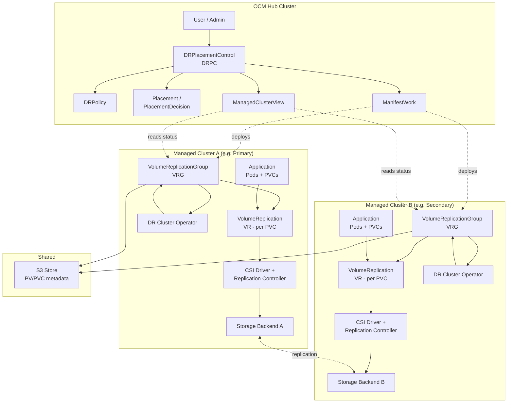
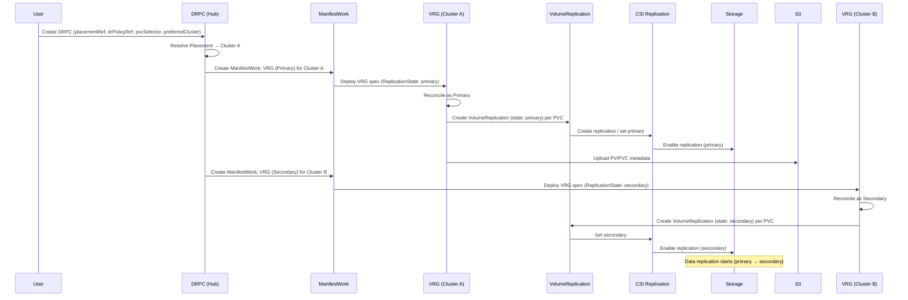
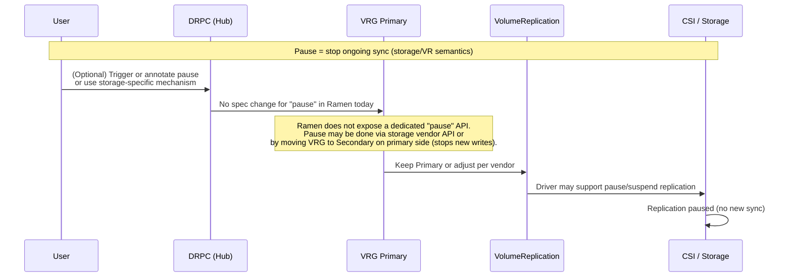
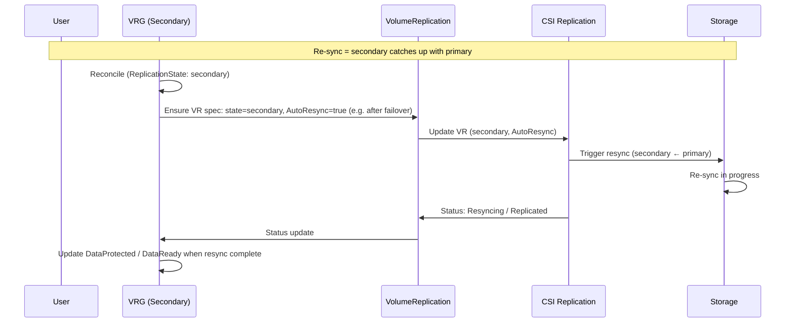
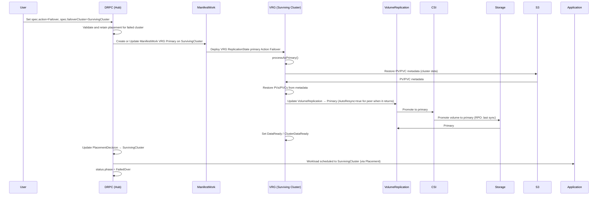
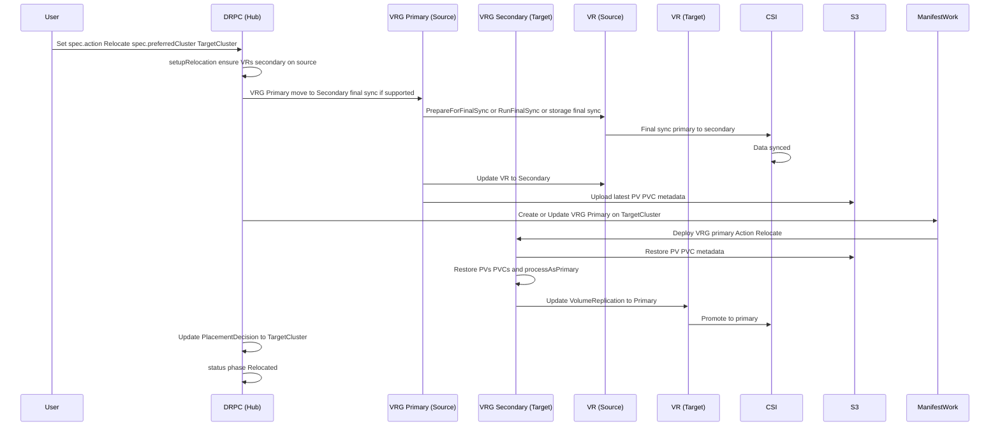
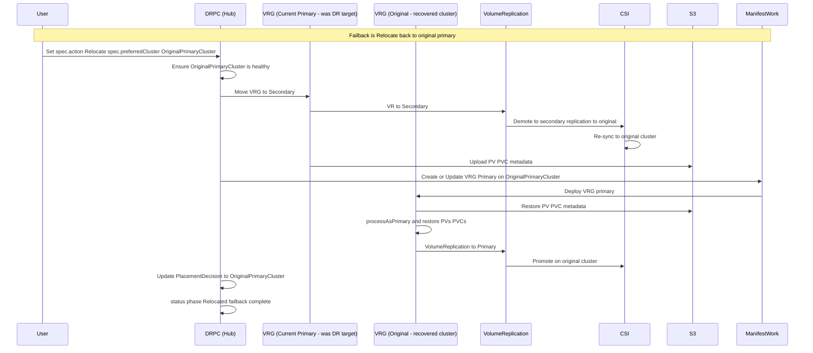
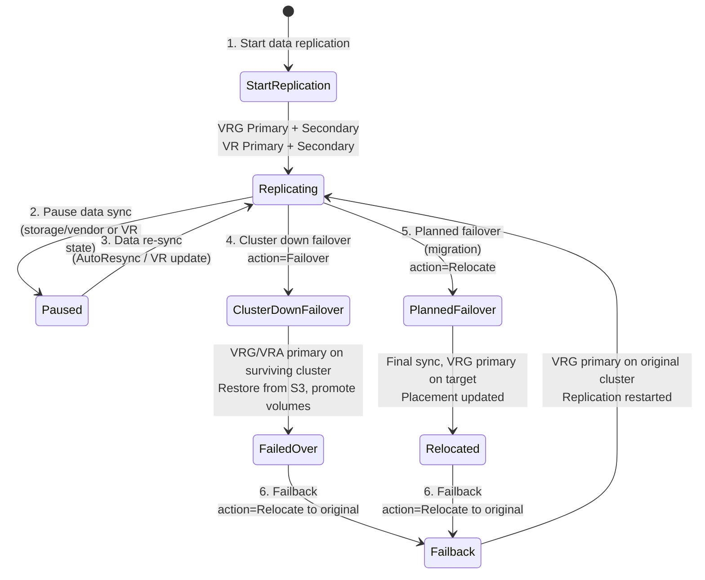
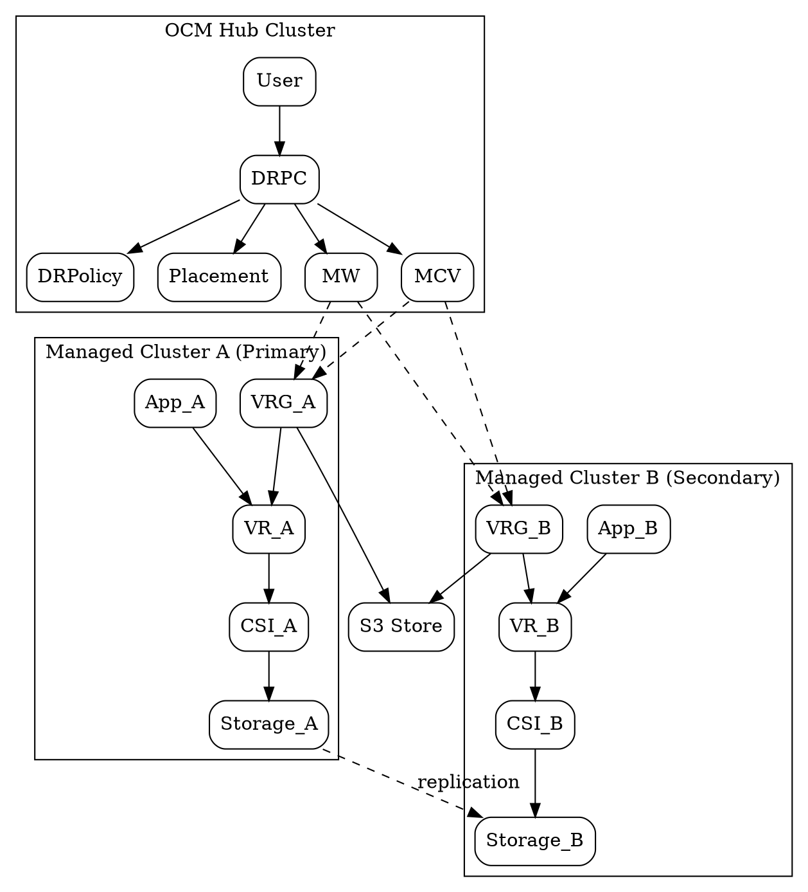
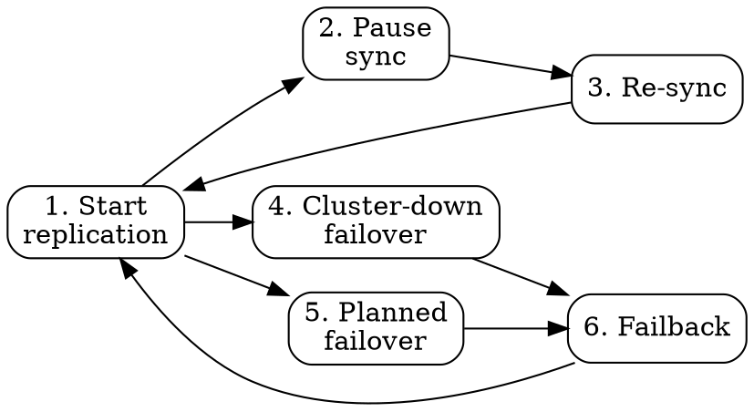

# CSI-Addon Based DR: Architecture and Operation Workflows

This document describes the **basic architecture** and **operation workflows** when customers use standard **CSI-addon based DR** with Ramen. It maps the six typical storage DR operations to how Ramen and the CSI-addons VolumeReplication API work.

## Standard Storage DR Operations Covered

1. **Start data replication** – Enable protection and start replicating volumes to the peer cluster.
2. **Pause data sync** – Temporarily stop or pause replication (storage/VR state).
3. **Data re-sync** – Resume or re-synchronize data (e.g. before planned failover or after pause).
4. **Cluster-down failover** – Unplanned failover when the primary cluster is lost.
5. **Planned failover (migration)** – Planned relocation to the peer cluster.
6. **Failback** – Return the workload to the original primary cluster after recovery.

---

## Basic Architecture (CSI-Addon Based DR)

Ramen uses the [CSI-addons replication specification](https://github.com/csi-addons/spec/tree/main/replication) and the **VolumeReplication** (and optionally **VolumeGroupReplication**) APIs. The following diagram shows the main components.

**Component roles:**

- **DRPC**: User-facing DR control; references DRPolicy and Placement; triggers relocate/failover.
- **DRPolicy**: Defines the two DR clusters and replication (e.g. scheduling interval, class selectors).
- **VRG**: One per application (per cluster); manages lifecycle of **VolumeReplication** (VR) resources and PV/PVC metadata in **S3**.
- **VolumeReplication (VR)**: CSI-addon CR per PVC; drives **start/pause/resync** and **primary/secondary** at the storage layer.
- **CSI Driver + Replication Controller**: Implements the replication and state transitions (primary/secondary, sync, resync).
- **S3**: Stores PV (and optionally PVC) metadata so the peer cluster can restore bindings after failover/relocate.

---

## Operation Workflows

### 1. Start Data Replication

User enables DR for an application; Ramen and the CSI-addon start replication for the selected PVCs.

**Result:** Primary on Cluster A, Secondary on Cluster B; PV metadata in S3; replication ongoing.

---

### 2. Pause Data Sync

Replication is paused or suspended. In CSI-addon terms this is typically achieved by the **secondary** no longer actively accepting sync (e.g. VR set to secondary and driver or storage pauses sync), or by storage-specific semantics.

**Note:** Ramen does not currently expose a dedicated **pause** API. Pause is often implemented by:

- Storage vendor APIs or features (e.g. “suspend replication”), or
- Keeping VR as **Secondary** on the former primary (so no new writes are replicated) until resync.

Your interface can show “Pause” as a storage-level or vendor-specific step; the diagram above reflects that.

---

### 3. Data Re-Sync

Re-sync brings the secondary back in sync with the primary (e.g. after pause or before planned failover). With CSI-addons, **AutoResync** and VR state transitions drive this.

**Ramen behavior:** For **failover** action, VRG sets **AutoResync=true** on the VR when the VR is Secondary (so the new secondary can resync from the new primary). Re-sync is also implicit when both sides are healthy and VR is Primary on one side and Secondary on the other; the driver performs sync/resync.

---

### 4. Cluster-Down Failover (Unplanned)

Primary cluster is lost; user fails over to the surviving (secondary) cluster.

**Result:** Workload runs on the surviving cluster; volumes are primary there; PV/PVC restored from S3.

---

### 5. Planned Failover (Migration / Relocate)

Planned move to the peer cluster with optional final sync. Ramen calls this **Relocate**.

**Result:** Workload relocated to target cluster with controlled final sync and promotion.

---

### 6. Failback

Return workload to the original primary cluster after it has recovered. In Ramen this is another **Relocate** (or **Failover** if the current primary is down).

**Result:** Workload and volume primary are back on the original cluster; replication can run original → current (secondary) again.

---

## Combined Workflow Overview (All Six Operations)

---

## Graphviz Versions (Alternative Rendering)

### Architecture (Graphviz)

### Operation Flow Summary (Graphviz)

---

## Summary Table

| #   | Operation                        | Ramen / User action | CSI-addon / storage |
| --- | -------------------------------- | ------------------- | ------------------- |
| 1   | **Start data replication**       | Create DRPC (preferredCluster, placementRef, drPolicyRef, pvcSelector). Ramen creates VRG Primary on preferred cluster, VRG Secondary on peer; VRs created Primary/Secondary. | VR created per PVC; replication enabled (primary ↔ secondary). |
| 2   | **Pause data sync**              | No dedicated Ramen API; optional storage/vendor or custom flow. | Storage or driver “pause” / VR state (e.g. secondary only) to stop sync. |
| 3   | **Data re-sync**                 | VRG reconciliation; after failover, AutoResync=true on VR (Secondary). | VR Secondary + AutoResync; driver/storage performs resync. |
| 4   | **Cluster-down failover**        | Set DRPC `action=Failover`, `failoverCluster=surviving`. Ramen deploys VRG Primary on surviving cluster, restores from S3, promotes VR. | VR promoted to primary on surviving cluster; volume promoted. |
| 5   | **Planned failover (migration)** | Set DRPC `action=Relocate`, `preferredCluster=target`. Ramen runs final sync, moves VRG to Secondary on source, Primary on target. | Final sync; VR primary on target, secondary on source. |
| 6   | **Failback**                     | Set DRPC `action=Relocate`, `preferredCluster=original`. Ramen relocates back to original primary. | VR primary on original cluster; replication original → current. |

This gives you the **basic architecture** and **operation workflows** for standard CSI-addon based DR with Ramen, including the six storage operations you listed.
