# OCM/RHACM Dependencies - Diagrams

This document contains visual diagrams showing Ramen's dependencies on OCM/RHACM.

## Architecture Overview

## OCM API Dependency Graph

## Resource Flow Diagram

## Component Dependency Matrix

## ManifestWork Usage

## ManagedClusterView Usage

## Dependency Isolation Analysis

```mermaid
graph TB
    subgraph "Critical Dependencies"
        MW[ManifestWork<br/>🔴 Cannot Remove]
        MCV[ManagedClusterView<br/>🔴 Cannot Remove]
        Placement[Placement API<br/>🔴 Cannot Remove]
        MC[ManagedCluster<br/>🔴 Cannot Remove]
    end
    
    subgraph "Replaceable Dependencies"
        PR[PlacementRule<br/>🟡 Can Remove<br/>Legacy Support]
        Policy[Policy APIs<br/>🟡 Can Remove<br/>Secret Propagation]
    end
    
    subgraph "Alternative Approaches"
        DirectAPI[Direct K8s API<br/>Requires kubeconfigs]
        CustomPlacement[Custom Placement Logic<br/>Lose OCM features]
        CustomRegistry[Custom Cluster Registry<br/>Lose OCM integration]
    end
    
    MW -.could replace with.-> DirectAPI
    MCV -.could replace with.-> DirectAPI
    Placement -.could replace with.-> CustomPlacement
    MC -.could replace with.-> CustomRegistry
    PR -.remove.-> Placement
    Policy -.remove.-> DirectAPI
    
    style MW fill:#ff9999
    style MCV fill:#ff9999
    style Placement fill:#ff9999
    style MC fill:#ff9999
    style PR fill:#ffe699
    style Policy fill:#ffe699
```

## Code Organization

