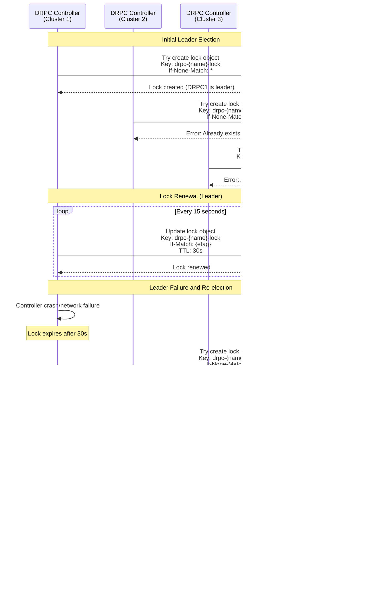

# DRPC on Managed Clusters - Detailed Sequence Diagrams

This document contains detailed sequence diagrams for key operations in the ACM-free architecture.

## Failover Operation Sequence

## Cluster Discovery and Registration

## Leader Election via S3

## State Coordination via S3

## Direct VRG Deployment (Replacing ManifestWork)

## Multi-Cluster Coordination During Failover

## Error Handling and Recovery

