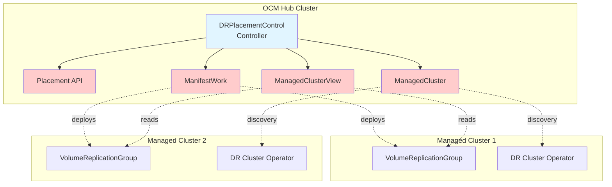
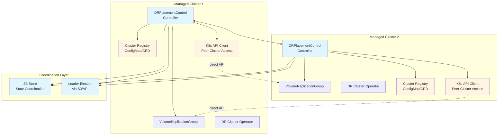
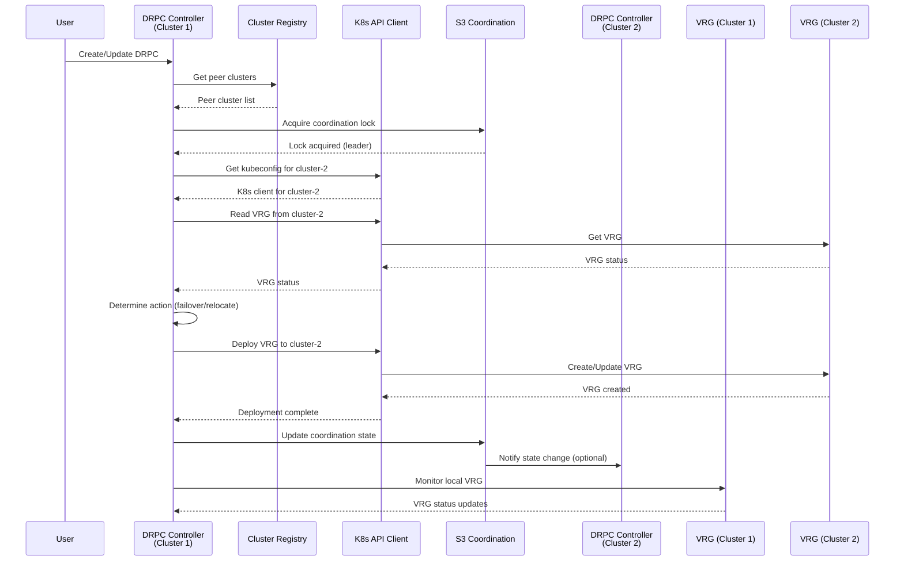
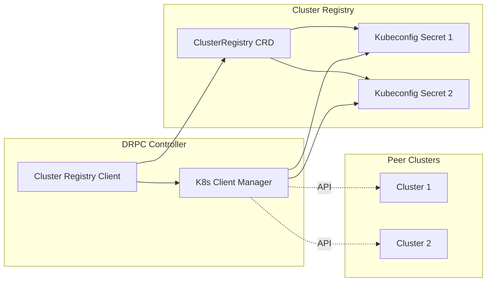
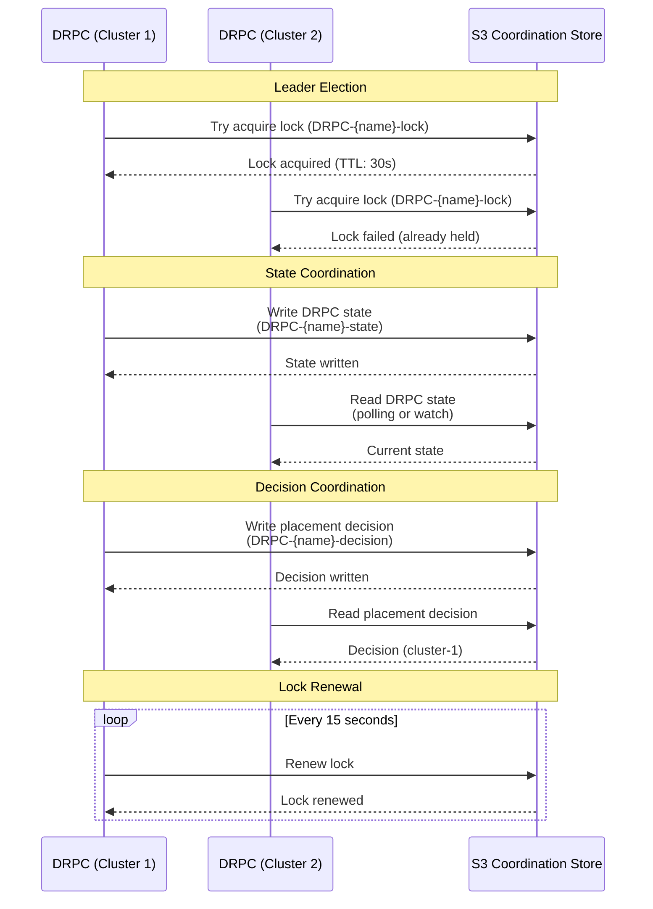

# DRPC on Managed Clusters - ACM Elimination Strawman

This document presents a strawman proposal for moving DRPlacementControl (DRPC) to managed clusters and eliminating all ACM (Open Cluster Management) dependencies.

## Executive Summary

**Current Architecture**: DRPC runs on the OCM hub cluster and uses ACM APIs (ManifestWork, ManagedClusterView, Placement) to orchestrate DR operations across managed clusters.

**Proposed Architecture**: DRPC runs on each managed cluster and coordinates directly via:

- Direct Kubernetes API access to peer clusters
- Custom cluster registry (replacing ManagedCluster)
- Direct resource deployment (replacing ManifestWork)
- Direct resource reading (replacing ManagedClusterView)
- Custom placement logic (replacing Placement/PlacementDecision)

## Current Architecture (With ACM)



## Proposed Architecture (Without ACM)



## Key Design Decisions

### 1. DRPC Deployment Model

#### Option A: Active-Active (Recommended)

- DRPC runs on all managed clusters
- Uses leader election to determine active coordinator
- All DRPCs can read local VRG status
- Only leader coordinates cross-cluster operations

#### Option B: Active-Passive

- DRPC runs on one cluster (primary)
- Requires failover mechanism for DRPC itself
- Simpler but less resilient

**Recommendation**: Option A (Active-Active) for resilience.

### 2. Cluster Discovery and Registry

**Replace**: ManagedCluster API

**With**: Custom Cluster Registry

```yaml
apiVersion: ramendr.openshift.io/v1alpha1
kind: ClusterRegistry
metadata:
  name: dr-clusters
spec:
  clusters:
    - name: cluster-1
      region: us-east-1
      kubeconfigSecret: cluster-1-kubeconfig
      endpoint: https://api.cluster-1.example.com:6443
      status: Available
    - name: cluster-2
      region: us-west-1
      kubeconfigSecret: cluster-2-kubeconfig
      endpoint: https://api.cluster-2.example.com:6443
      status: Available
```

**Storage**: ConfigMap or Custom Resource (CRD)

**Discovery**:

- Manual configuration via ClusterRegistry
- Or auto-discovery via DRPolicy (clusters reference each other)

### 3. Resource Deployment

**Replace**: ManifestWork

**With**: Direct Kubernetes API Client

```go
type DirectResourceDeployer struct {
    clusterClients map[string]client.Client // cluster name -> kubeconfig client
}

func (d *DirectResourceDeployer) DeployVRG(ctx context.Context, cluster string, vrg *rmn.VolumeReplicationGroup) error {
    client, ok := d.clusterClients[cluster]
    if !ok {
        return fmt.Errorf("no client for cluster %s", cluster)
    }
    return client.Create(ctx, vrg)
}
```

**Kubeconfig Management**:

- Stored in Secrets (one per peer cluster)
- Referenced in ClusterRegistry
- Rotated via standard K8s secret management

### 4. Resource Reading

**Replace**: ManagedClusterView

**With**: Direct Kubernetes API Client

```go
type DirectResourceReader struct {
    clusterClients map[string]client.Client
}

func (d *DirectResourceReader) ReadVRG(ctx context.Context, cluster, name, namespace string) (*rmn.VolumeReplicationGroup, error) {
    client, ok := d.clusterClients[cluster]
    if !ok {
        return nil, fmt.Errorf("no client for cluster %s", cluster)
    }
    vrg := &rmn.VolumeReplicationGroup{}
    err := client.Get(ctx, types.NamespacedName{Name: name, Namespace: namespace}, vrg)
    return vrg, err
}
```

### 5. Cluster Selection

**Replace**: Placement/PlacementDecision

**With**: Custom Placement Logic

```go
type PlacementManager struct {
    clusterRegistry *ClusterRegistry
    drPolicy        *DRPolicy
}

func (p *PlacementManager) SelectCluster(ctx context.Context, drpc *DRPlacementControl) (string, error) {
    // Use preferredCluster from DRPC spec
    if drpc.Spec.PreferredCluster != "" {
        return p.validateCluster(drpc.Spec.PreferredCluster)
    }
    
    // Or select based on DRPolicy
    return p.selectFromDRPolicy(drpc.Spec.DRPolicyRef)
}
```

**Decision Storage**:

- Store in DRPC status (replacing PlacementDecision)
- Or use S3 for coordination

### 6. Coordination Mechanism

**Challenge**: How do DRPCs on different clusters coordinate?

#### Option A: S3-Based Coordination (Recommended)

- Use S3 as coordination store
- Store DRPC state, decisions, locks
- Leader election via S3 atomic operations

#### Option B: Direct API Communication

- DRPCs call each other's APIs directly
- Requires mutual authentication
- More complex but lower latency

#### Option C: Hybrid

- S3 for state/decisions
- Direct API for real-time operations

**Recommendation**: Option A (S3-Based) for simplicity and reliability.

## Detailed Component Design

### DRPC Controller (Managed Cluster)



### Cluster Registry Component



### Coordination via S3



## Migration Path

### Phase 1: Add Abstraction Layers

1. Create interfaces for cluster management, resource deployment, resource reading
2. Implement both ACM and direct K8s API versions
3. Add feature flag to switch between implementations
4. No functional changes

### Phase 2: Implement Direct K8s Components

1. Implement ClusterRegistry CRD
2. Implement DirectResourceDeployer
3. Implement DirectResourceReader
4. Implement S3-based coordination
5. Test in parallel with ACM implementation

### Phase 3: Move DRPC to Managed Clusters

1. Update DRPC to be namespaced (if not already)
2. Deploy DRPC controller to managed clusters
3. Remove hub operator deployment
4. Update RBAC for managed cluster access

### Phase 4: Remove ACM Dependencies

1. Remove ManifestWork usage
2. Remove ManagedClusterView usage
3. Remove Placement/PlacementDecision usage
4. Remove ManagedCluster usage
5. Remove ACM imports from go.mod

## Implementation Details

### Cluster Registry API

```go
// ClusterRegistry defines a registry of DR clusters
type ClusterRegistry struct {
    metav1.TypeMeta   `json:",inline"`
    metav1.ObjectMeta `json:"metadata,omitempty"`
    
    Spec   ClusterRegistrySpec   `json:"spec,omitempty"`
    Status ClusterRegistryStatus `json:"status,omitempty"`
}

type ClusterRegistrySpec struct {
    Clusters []ClusterInfo `json:"clusters"`
}

type ClusterInfo struct {
    Name             string `json:"name"`
    Region           string `json:"region,omitempty"`
    KubeconfigSecret string `json:"kubeconfigSecret"` // Secret name containing kubeconfig
    Endpoint         string `json:"endpoint,omitempty"` // Optional: API server endpoint
    Status           string `json:"status,omitempty"` // Available, Unavailable, etc.
}
```

### S3 Coordination Structure

```text
s3://ramen-coordination/
  ├── drpc-{namespace}-{name}/
  │   ├── lock              # Leader election lock
  │   ├── state             # Current DRPC state
  │   ├── decision          # Placement decision
  │   └── history/          # Operation history
  └── clusters/
      └── {cluster-name}/
          └── status        # Cluster health status
```

### Kubeconfig Secret Format

```yaml
apiVersion: v1
kind: Secret
metadata:
  name: cluster-2-kubeconfig
  namespace: ramen-system
type: Opaque
data:
  kubeconfig: <base64-encoded-kubeconfig>
```

## Benefits

1. **No ACM Dependency**: Eliminates all OCM/RHACM dependencies
2. **Simpler Architecture**: Direct API access is more straightforward
3. **Better Resilience**: DRPC on each cluster (no single point of failure)
4. **Lower Latency**: Direct API calls vs. going through hub
5. **More Control**: Full control over cluster communication

## Challenges

1. **Kubeconfig Management**: Need to manage kubeconfigs for all peer clusters
2. **Security**: Mutual authentication between clusters
3. **Coordination Complexity**: Need robust coordination mechanism
4. **Network Requirements**: Direct network access between clusters
5. **State Management**: Need reliable state coordination (S3)
6. **Leader Election**: Need robust leader election mechanism

## Alternatives Considered

### Alternative 1: Hub-Based Without ACM

- Keep hub architecture but replace ACM APIs
- Pros: Simpler migration
- Cons: Still have hub as single point of failure

### Alternative 2: Centralized Coordinator

- Single coordinator service (not on hub)
- Pros: Simpler coordination
- Cons: Still have single point of failure

### Alternative 3: Event-Driven Coordination

- Use message queue (Kafka, RabbitMQ) for coordination
- Pros: Decoupled, scalable
- Cons: Additional infrastructure dependency

## Recommendations

1. **Start with Phase 1**: Add abstraction layers (low risk)
2. **Implement S3 Coordination**: Use S3 for state/decisions (reliable, already used)
3. **Active-Active DRPC**: Deploy DRPC on all clusters (resilience)
4. **Gradual Migration**: Support both ACM and direct modes during transition
5. **Feature Flag**: Use feature flag to enable/disable ACM-free mode

## Open Questions

1. **Network Connectivity**: Do clusters have direct network access to each other?
2. **Kubeconfig Rotation**: How to handle kubeconfig rotation/expiration?
3. **Multi-Cluster Failover**: How to handle DRPC failover if cluster hosting DRPC fails?
4. **Conflict Resolution**: How to resolve conflicts if multiple DRPCs try to coordinate?
5. **Performance**: Is S3 coordination fast enough for real-time operations?
