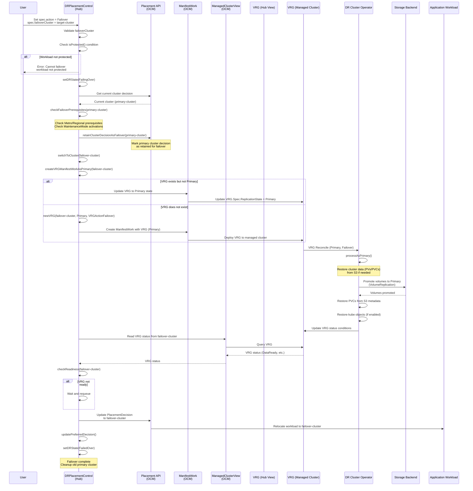
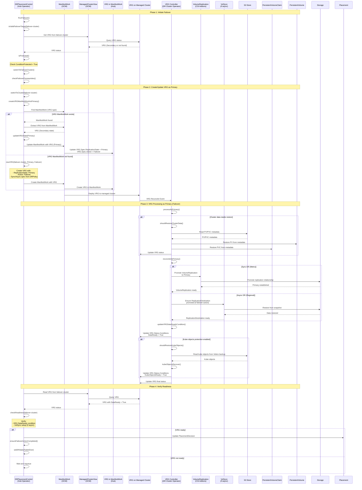
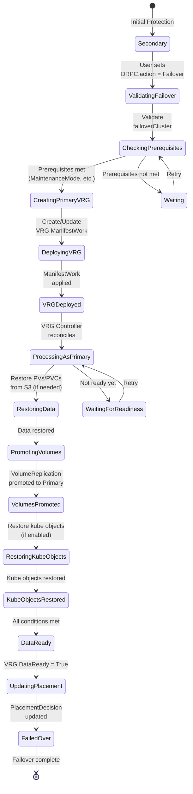
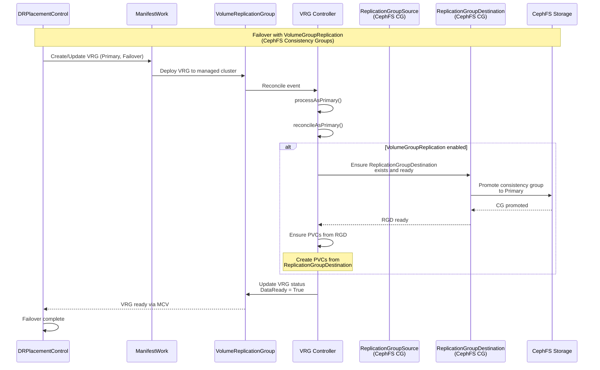
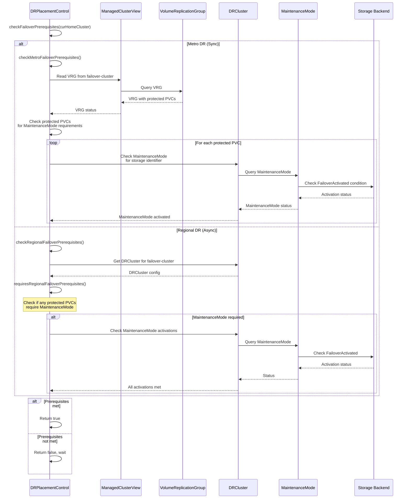
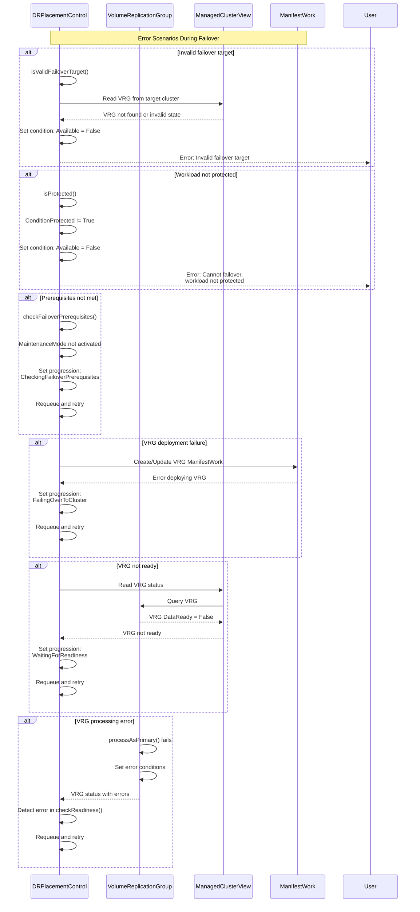

# Failover Operations Sequence Diagrams

This document contains sequence diagrams for failover operations in Ramen, with special focus on VolumeReplicationGroup (VRG) objects.

## Overview

Failover operations in Ramen involve:

1. **DRPlacementControl** orchestrating the failover
2. **VolumeReplicationGroup (VRG)** transitioning from Secondary to Primary
3. **ManifestWork** deploying VRG to managed clusters
4. **ManagedClusterView** reading VRG status
5. **Placement/PlacementDecision** controlling cluster selection
6. **DR Cluster Operator** processing VRG on managed clusters

## Main Failover Sequence

## Detailed VRG Failover Sequence

## VolumeReplicationGroup State Transitions During Failover

## Failover with VolumeGroupReplication (CephFS Consistency Groups)

## Failover Prerequisites Check Sequence

## Error Handling During Failover

